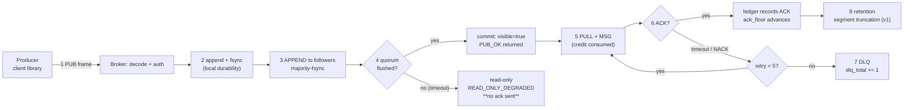

# 核心概念

一页讲清消息模型 —— 每个名词是什么意思、干什么用。读完再看[架构](./architecture.md)页，那页默认你已经知道这些。

命名细节（字段到底叫什么、为什么）在[术语表](./glossary.md)。**本页讲含义，不讲拼写。**

## 1. 消息模型

MortarMQ 有三种角色。**生产者**写消息，**broker** 存储并路由，**消费者**读消息。生产者和消费者是嵌在你应用里的库，broker 是服务端。

每条消息**恰好属于一个 topic**，topic 被切成固定数量的**分区**。分区是排序的单位，也是存储的单位 —— 每个分区对应一段只追加的日志文件序列。

### 一条消息走过的路（全链路）

每一起「我的消息不见了」的排查都从这里开始。指不出它停在哪一阶段，就是在瞎猜：

这条链路上有两个性质值得记牢：

- **第 4 阶段之前什么都没被确认。** 2 到 4 之间崩溃，**不会**丢掉任何「生产者以为成功了」的消息 —— `PUB_OK` 还没发出去。这就是为什么 at-least-once 的起点是**确认**，不是**写入**。
- **第 6 阶段是消费者唯一可能丢消息的地方，而它并不丢** —— 它重投（最多 5 次），然后进死信。指标里的「dropped」意思是**重试耗尽**，不是**被扔掉**。

## 2. Topic

topic 是一条同类型消息的具名流。它必须用 `DECLARE` **显式创建**，绝不隐式创建：对不存在的 topic 订阅会返回 `0x0008`。

v0 中名字只做精确匹配 —— 不支持通配符 —— 并在声明时校验：不许空 token、不许 `$` 前缀、最多 255 字节。

## 3. 分区

分区数在 topic 创建时定死，**v0 不能改**。分区选择是 `fnv1a32(key) % partition_count`，所以 **key 决定排序**：同 key 同分区，消息保持有序。

分区同时也是**归属的单位** —— 一个组里同一时刻只有一个消费者拥有某个分区，这个归属由 epoch 围栏保护（见 §8）。

## 4. 消费者组

组是一组共享同一 topic 分区的消费者。三个消费者加入一个 12 分区的 topic，各分到约 4 个；再加第四个，就只有**部分**分区会移动。

组的存在让「扩消费者」不必惊动生产者。每个组有自己的游标，因此两个组可以独立读同一个 topic。

## 5. at-least-once 投递

消息被投递，而投递只有在消费者**确认（ACK）**之后才算完成。如果确认没在租约超时前到达（`delivery_lease_ms`，30 s），消息会被重投。

这意味着消费者**可能看到同一条消息两次** —— 是 at-least-once，不是 exactly-once。防止**业务**重复副作用的是幂等：生产者按 `(producer_id, producer_seq)` 去重，消费者用**自己的业务标识**做幂等键，**绝不用 `delivery_id`**。

## 6. 投递台账与 ack floor

**台账（ledger）**把 `DELIVER` 和 `ACK` 事件记在**消息记录之外**。正因为是分开的，它才能扛过崩溃：重启时重投定时器从台账重建 —— `kill -9` 保证就是这么来的。

`ack_floor` 是「它之前全部已确认」的最高序号 —— 连续水位。未消费深度 = `last_seq - ack_floor`，也正是 `mortarmq_partition_depth` 报的东西。

## 7. 重试、DLQ 与 dropped

投递失败按退避重投，上限 `delivery_max_attempts`（5 次）。第五次失败后写入**死信队列（DLQ）**，而不是无限重试。

三个计数器追踪这件事，且必须满足 `dlq_total <= dropped_total`：`dropped` 数的是耗尽重试的消息，`dlq` 数的是真正进了 DLQ 的。对不上就说明记账错了。

## 8. Epoch：围栏家族

六个计数器长得很像，但**不可互换**。规矩是：**每个 epoch 围栏一类特定的角色**。

- `leader_epoch` —— 复制组的 leader 版本。它用来拒绝过期 leader 的写入。
- `membership_epoch` —— **成员集合**的版本。消费者加入/离开时变。
- `assignment_epoch` —— **目标分配**的版本。
- `installed_assignment_epoch` —— 成员**实际已装载**的版本。它与 `assignment_epoch` 的差值就是「协调器发了，成员还没执行」。
- `ownership_epoch` —— **单个分区**的归属。这一条拒绝「消费者操作一个它已不再拥有的分区」。
- `mutation_id` —— 元数据日志的单调变更号，是能扛过故障切换的下限。

本节只需记一条：**过期角色是被 epoch 比较拒绝的，不是被超时拒绝的。** 超时管活性，epoch 管安全。

## 9. Quorum 与多数派 fsync

一次写入在**多数派**副本完成 fsync 后才提交 —— 3 节点集群里是 leader + 1 个 follower。只有这时 `commit_seq` 才推进、`PUB_OK` 才返回。

若多数派无法在时限内达成，broker 进入只读并返回 `READ_ONLY_DEGRADED`。它**绝不**承认一件提交不了的事：失败模式是一次看得见的错误，永不静默丢数据。见 [RB-1](../guides/runbook.md#rb-1-quorum-降级-→-只读)。

## 10. 元数据日志（MMML）

集群元数据 —— topic、组、leader —— 存在自己的只追加变更日志加定期快照里（`data/metadata/`）。它**不是** Raft：变更走单写者串行，由 `mutation_id` 围栏。

当日志不可信时，broker 选择**隔离**而不是猜：状态移入 `data/metadata/quarantine/` 并停止服务。从隔离目录自动重放**刻意不实现** —— 对账是人来做的决定。

## 11. Credit 窗口（背压）

消费者没有 credit 就不能拉。窗口初始 **256 条 / 2 MiB**，按批归还 —— 32 个 ACK、1 MiB、低水位、20 ms 定时器，先到先触发。

credit 是慢消费者与 broker 无界内存之间**唯一的**闸门。用光它是正常流控（`0x4006 NO_CREDIT`），不是错误。

## 12. Rebalance

组成员变化时重新分配分区。重分配是**增量**的：只有离开那个成员的分区移动，未受影响的分区连 `ownership_epoch` 都不动。

这就是为什么增量 rebalance 便宜 —— 全量洗牌会让每个消费者的游标位置白作废一次。

## 13. Segment 与 checkpoint

每个分区的日志切成 **segment**（默认 64 MiB），配稀疏索引用于寻址、原子 checkpoint 用于恢复。重启时 broker 从最后一个 checkpoint 向前重放。

segment 带 `magic` 和 `format_version`；二进制遇到读不懂的版本会**拒绝**而不是猜着读（升级 case F3）。

## 14. 诚实边界

v0 没有：TLS、动态 token、按 topic 授权、配置热加载、日志截断、Raft 元数据 quorum、动态成员、topic 通配符、可变分区数。

每一项都是刻意裁剪，且每一项都有升级路径 —— 见[升级与回滚](../guides/upgrade.md)与 [FAQ §5](../guides/faq.md#_5-诚实回答)。完整威胁模型在[这里](./security.md)。
