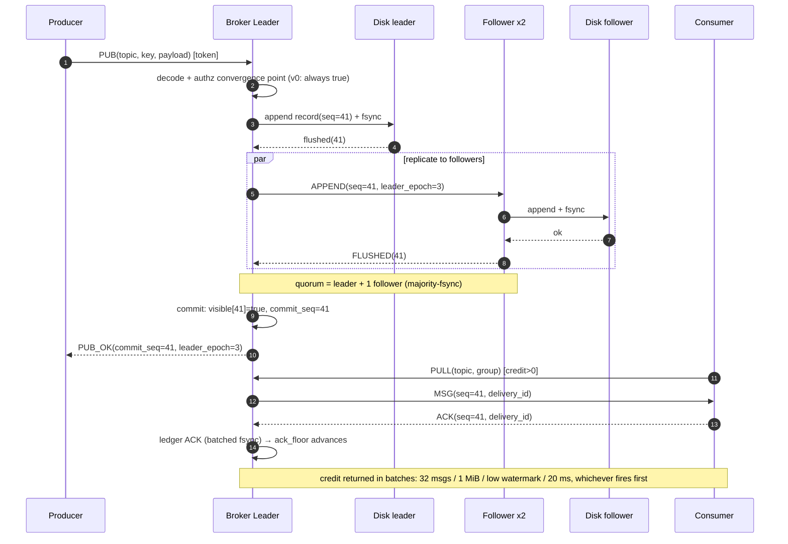

# 时序图 —— 消息路径与归属变更

消息与分区归属在具名参与者之间**实际如何移动**。两个场景，都是带 `autonumber` 的 `sequenceDiagram`。

> **与[用例与流程](./use-cases-and-flows.md)的关系：** 下面场景 A 的稳态路径，就是那一页用活动 flowchart 画的同一条链路。要看分支条件和守恒公式读那一页；要看参与者次序和消息内容读本页。

## 发布落盘 + 消费投递（主成功路径）



### 异常分支（同一次交互的失败路径汇总）

| 失败点 | 行为 | 错误 / 状态 |
|---|---|---|
| token 非法 | 拒绝该连接的首帧 | ERR AUTH_FAILED（通用文案 + 100 ms） |
| 两个 follower 都落后 | ack 超时 → 进入只读 | ERR QUORUM_LOST / READ_ONLY_DEGRADED |
| 旧 leader 重新加入 | epoch 围栏：追加被拒 | STALE_LEADER_EPOCH（内部） |
| 消费者无 credit | MSG 调度暂停（不在帧中间停读） | 等 credit（不是错误） |
| PUB 重放（客户端重试） | 生产者按 (producer_id, producer_seq) 去重；`delivery_id` 只围栏消费侧 | 幂等，不重复投递 |

### 与仿真、模型检查的关系

- 这条动作序列是仿真「黄金轨迹」之一（台架在第 3–5 步之间注入 `kill -9`）。
- 「commit 之前 quorum 已 flush」是 `lease.qnt` 不变量 `visibleImpliesQuorumFlushed` 在协议层的投影。

## 场景 A：消费者组成员变更（增量 rebalance）

```mermaid
sequenceDiagram
    autonumber
    participant C1 as Consumer-1
    participant CO as Coordinator (broker leader)
    participant C2 as Consumer-2

    C2->>CO: JOIN(group, subscription)
    Note over CO: membership_epoch += 1<br/>target assignment: pure function assign(members, partitions, prev)
    Note over C1: C1's partitions unchanged → no notice, epochs untouched (CB3 / golden 23)
    CO->>C2: NOTICE ASSIGN(notice_id, new partitions)
    C2-->>CO: CONTROL_ACK(ASSIGN, OK)
    Note over CO,C2: Incremental (CB3): only the departed member's partitions move; unaffected partitions keep their ownership epochs

    C2->>CO: LEAVE
    Note over CO: membership_epoch += 1<br/>assignment_epoch += 1
    CO->>C1: NOTICE REVOKE(notice_id, only C2's former partitions)
    C1-->>CO: CONTROL_ACK(REVOKE, OK)
    CO->>C1: NOTICE ASSIGN(notice_id, take-over partitions)
    C1-->>CO: CONTROL_ACK(ASSIGN, OK)
```

## 场景 B：lease 超时的降级选举（Prepare/Install）

```mermaid
sequenceDiagram
    autonumber
    participant L as Leader(epoch=3)
    participant F1 as Follower-1
    participant F2 as Follower-2

    Note over L,F2: follower lease expired without a heartbeat
    F1->>F1: Prepare(candidate=4) persists promise
    F1->>F2: PREPARE(epoch=4)
    F2->>F2: promise(4) persisted, replies logEnd
    F2-->>F1: PREPARE_ACK(4, commit_seq)
    Note over F1,F2: majority promise (2/3) + take the highest durable prefix
    F1->>F1: Install: truncate uncommitted → take office as epoch=4
    F1->>F2: INSTALL(epoch=4)
    F2-->>F1: INSTALLED
    Note over L: when the old leader returns, append(epoch=3) is fenced;<br/>it demotes to follower and catches up
    L->>F1: APPEND(seq, epoch=3)
    F1-->>L: REJECT STALE_LEADER_EPOCH
```

## 语义锚点

| 交互 | 保证 | 验证手段 |
|---|---|---|
| 场景 A 全部 | 增量性 / 安全性 / 活性 | CB1–CB4；慢消费者 / 分区注入 |
| 场景 B：Install 前必须有多数派 promise | 不出现脑裂 | `inv_installNeedsQuorumPromise` |
| 场景 B：围栏 | 可见日志永不回退 | `visibleMonotonic` |
| 共同约束 | 元数据变更一律走单写者元数据日志 | DECLARE/NOTICE 幂等性 |
