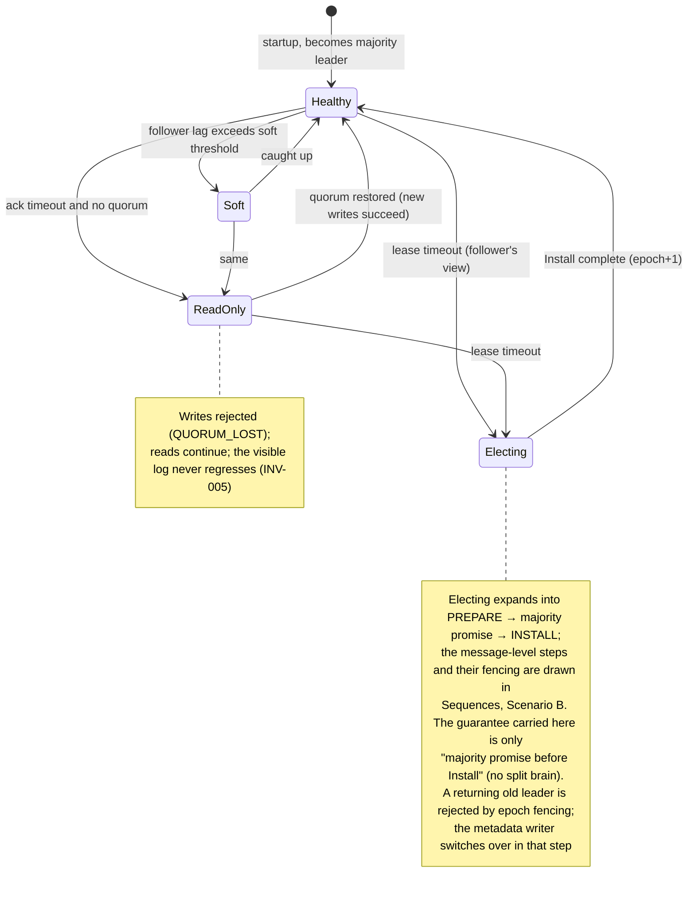
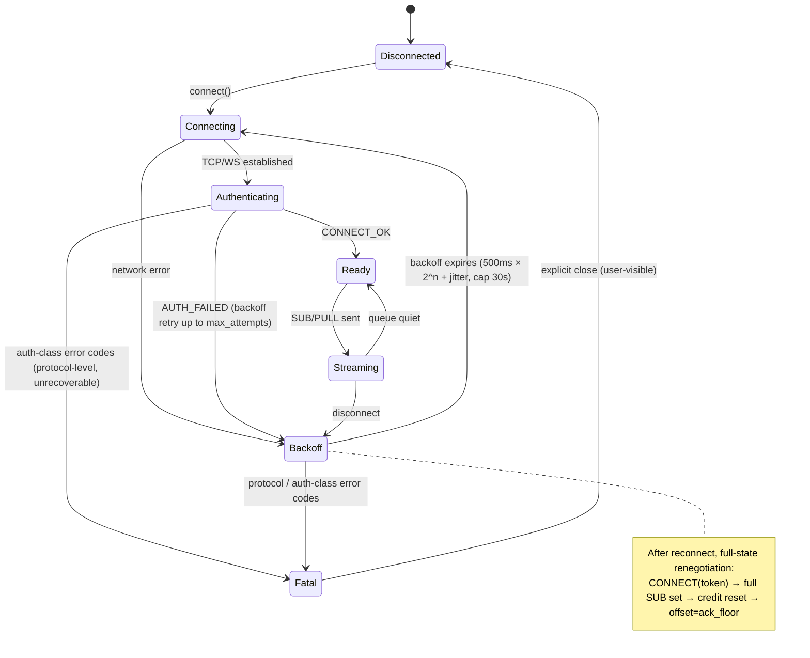
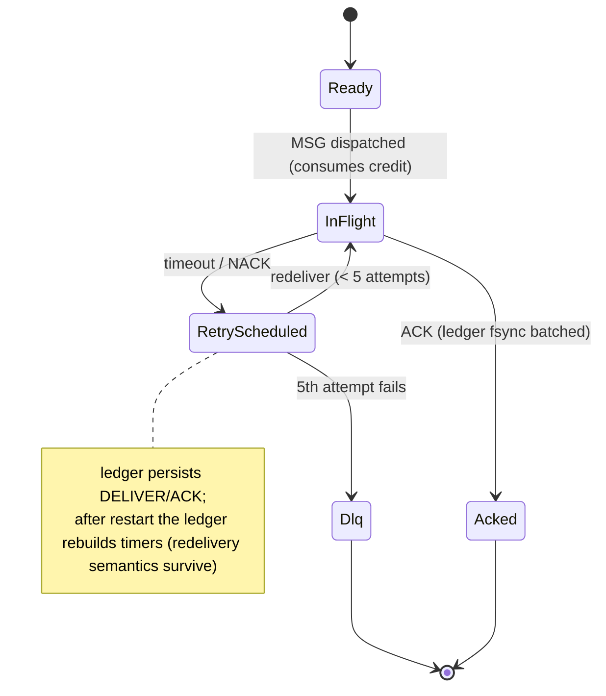
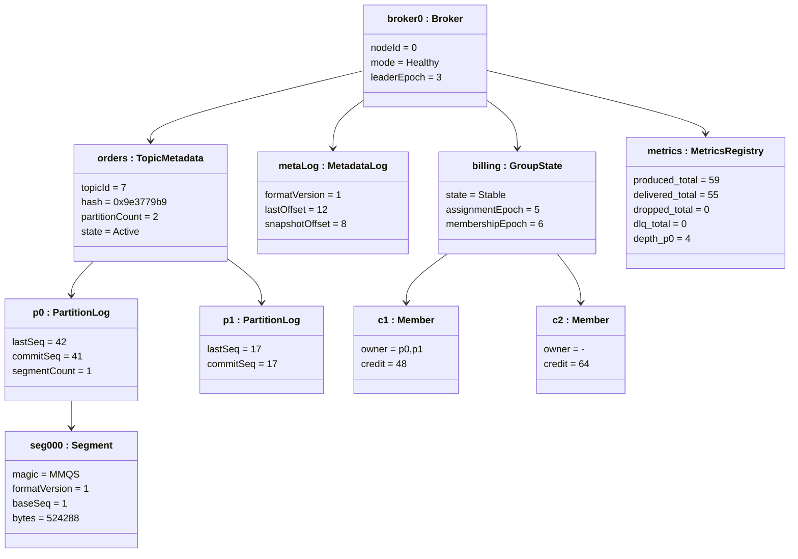

# 状态、时限与不变量

三台状态机、所有设计都必须落进去的延迟预算，以及一张把三者绑在一起的运行时快照断言表。

> **为什么[对象快照](#运行时快照)放在这一页而不在[结构](./structure.md)：** 它的载荷是一张**一致性断言表**，用的是与状态机同一套不变量词表（INV / CM / CB），而不是关于类型布局的陈述。

> UML 说明：mermaid `stateDiagram-v2` 直接承载状态机语义。mermaid 没有原生的时序约束图，因此[时限](#时限)用 ASCII 泳道时间线加预算表。

## 状态机

### 状态机 1：Broker quorum / leader 状态



### 状态机 2：客户端连接状态（无 sink 性质即 CS1）



### 状态机 3（补充）：投递消息状态（台账视角）



### 跨状态机的一致性约束

- broker ReadOnly 与客户端 Backoff 的交互：收到 `READ_ONLY_DEGRADED` 时，客户端把它当作「等恢复」来处理。
- 客户端的 Fatal 分类与 broker 的错误码分段**共用同一份 enum**（CI 断言）。

## 时限

> 以下所有数字都是**设计预算（目标值）**，待实测（基准报告）后更新 —— **未测过的数字绝不写成结论**。

### 时间线 1：PUB 端到端确认（多数派 fsync，3 节点 LAN）

```text
t(ms)  0        0.1      0.3       1.0        1.2        1.4      1.6
PUB ───┤ send   │        │         │          │          │        │
       ├────────►│ decode │         │          │          │        │
       │         ├──► append + fsync           │          │        │
       │         │        ├─ APPEND ►│          │          │        │  (follower)
       │         │        │         ├─ fsync ──►│          │        │
       │         │        │         │           ├─ FLUSHED ►│       │
       │         │        │         │           │          ├─commit─┤
       │◄───────────────────────────────────────────────── PUB_OK ──┤
                                                │
P50 budget ≤ 1.5 ms | P99 budget ≤ 5 ms (NVMe fsync dominates)
```

| 段 | 预算 | 主导成本 | 备注 |
|---|---|---|---|
| decode | ≤ 0.05 ms | BytesView 零拷贝 | — |
| 本地 append + fsync | ≤ 0.3–1 ms | NVMe fsync | fsync 占掉预算大头 |
| APPEND 网络 | ≤ 0.1 ms | LAN RTT | — |
| follower fsync | ≤ 0.3–1 ms | 与 leader 并行等待 | — |
| FLUSHED + commit + OK | ≤ 0.1 ms | 内存操作 | — |
| **合计** | **P50 ≤ 1.5 ms / P99 ≤ 5 ms** | — | 超预算 → 查 fsync 与 GC（零分配设计） |

### 时间线 2：投递与重投的节律

```text
MSG dispatched ──┬────────────────────────────┐
                 │ credit return triggers (any) │
                 │  · 32 ACKs                   │
                 │  · 1 MiB returned            │
                 │  · below the low watermark   │
                 │  · 20 ms timer (latency cap) │
ACK ─────────────┤◄── CREDIT within 20 ms ──────┤
redelivery       ├─ attempt 1: +1 s, attempt 2: +2 s, attempt 3: +4 s, attempt 4: +8 s
backoff          │           (retry_backoff_base_ms=1000 × 2^n + jitter, cap max_backoff=30 s)
                 ├─ attempt 5 fails → DLQ (distinct from the client reconnect backoff 500ms × 2^n)
long poll        ├─ client PULL hangs up to 5 s (returns immediately when messages arrive)
heartbeat        ├─ client→broker PING every 30 s; server closes after 1.5×30 s silence
                 │           (keepalive semantics; v0 has no broker→client heartbeat frame)
```

### 时间线 3：周期任务（统一走 Clock 抽象，单调时钟）

| 定时器 | 周期 / 上限 | 用途 | Clock 性质 |
|---|---|---|---|
| Statsd 式指标快照 | 60 s（NSQ 默认） | 推进分位数窗口 | CL1 / CL2 |
| Lease 心跳 | leader→follower 每周期（早于 lease 截止） | 选举的活性触发器 | CL1–CL3 |
| Ack 台账 fsync 批 | 20 ms 或 32 条，先到者 | 持久化批处理 | CL1 |
| CREDIT 归还 | 20 ms 延迟上限 | 流控活性 | CL1 / CL2 |
| 元数据快照 | 8192 条 / 64 MiB | 重放预算 | — |

### 时间维度的安全约束（对齐单调时钟纪律）

- **所有调度只使用单调时钟**；墙上时钟只出现在日志文本里。
- 时钟回拨/跳变是仿真套件里的注入用例；CL3 性质断言「回拨不打乱触发顺序」。

## 运行时快照

> UML 说明：对象图是类图在某一时刻的**快照**。mermaid 没有原生对象图，这里用类图的实例记法（`:Instance`）加一张快照表来近似。实现阶段可以让 `/stats` 的 JSON 生成真实快照，用本例的一致性断言去核对。

### 快照场景

一个 3 节点集群正在运行：topic `orders`（2 个分区）已存在，组 `billing` 有两个消费者在线；leader = broker-0，epoch = 3；partition-0 持久化到 42、确认到 38。



这里被实例化的类（`Broker`、`PartitionLog`、`Segment`、`MetadataLog`、`GroupState`、`MetricsRegistry`）定义在[结构](./structure.md)页；这是它们在某一时刻的**取值视图**，不是另一套类型。

### 快照一致性断言（此刻必须成立的性质 → 登记册映射）

| # | 断言 | 性质 |
|---|---|---|
| 1 | `p0.commitSeq(41) ≤ p0.lastSeq(42)`，且 `visible[1..41]` 每一位都已 quorum flush | INV-006（仅模型检查可验） |
| 2 | `metrics.depth_p0 = lastSeq - ackFloor = 42 - 38 = 4`，且 `billing.c1` 的 in_flight ≤ credit | CM3 / INV-003 |
| 3 | `produced(59) = delivered(55) + dropped(0) + dlq(0) + Δdepth(4)` | CM1 / INV-001（静默窗口近似） |
| 4 | `p1` 无在途消息且 `lastSeq=commitSeq` → depth=0 | — |
| 5 | `billing` 分区总数 2 = c1.owner 数 + c2.owner 数 | CB1（每分区恰有一个 owner） |
| 6 | `metaLog.snapshotOffset(8) ≤ lastOffset(12)`（快照永远不跑在日志前面） | — |

### 用途

1. 文档示例：README/快速开始里「一个跑起来的 MortarMQ 长什么样」的插图来源。
2. 测试夹具：demo 阶段拿真实 `/stats` JSON 与这些快照断言交叉核对（把对象图从「插图」升格为「可验证」）。
