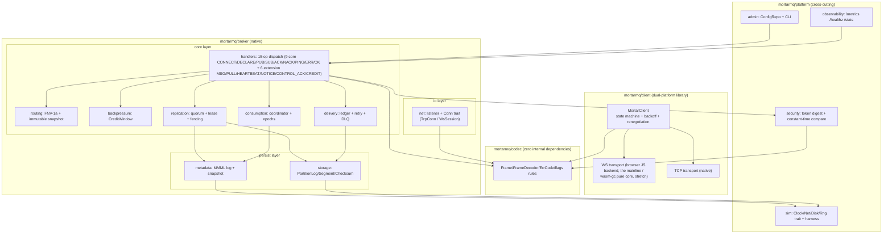

# 静态结构 —— 包、类型与依赖规则

自顶向下读：有哪些**包**、依赖允许朝哪个方向流；然后是包里住着哪些**类型**。两张图表达的是同一套规则 —— 组件图把它写成 CI 强制的 import 断言，类图把它写成类型级的边。

> UML 说明：mermaid subgraph 表达组件边界，箭头表示允许的依赖方向；classDiagram 承载类型结构，`<<trait>>` / `<<enum>>` 作标记。**反向或跨层依赖一律禁止**（CI import 断言）。

## 模块边界与依赖规则



### 模块依赖规则（「高内聚低耦合」的可执行定义）

| # | 规则 | 违反情形 | CI |
|---|---|---|---|
| 1 | `codec` 只允许 import `moonbitlang/core` | 出现任何内部依赖 = 红 | import 断言 |
| 2 | `storage` / `metadata` 不得 import broker/handlers 层 | 层次倒置 = 红 | import 断言 |
| 3 | `client` 包不得 import 任何服务端包 | 双平台隔离被破坏 = 红 | import 断言 |
| 4 | 横切包（observability/admin/security/sim）可被核心调用、也可调用 codec/core 接口；核心**绝不反向** import observability 实现 | 可观测开销失控 = 红 | import 断言 |
| 5 | 跨模块数据交换只走不可变值 / trait —— 不共享可变句柄（`BytesView` 借用例外仅限解码路径） | 评审红线 | 评审检查单 |

### 组件 ↔ 质量属性映射（节选）

| 组件 | 承载的主要属性 |
|---|---|
| codec | 零开销、语义清晰（单一 enum 来源） |
| storage / metadata | 可靠性、容错（隔离）、最终一致 |
| delivery / consumption | 功能正确性、可观测（守恒指标） |
| replication | 高可用、分布式容错、最终一致 |
| observability / admin / security | 可观测性、运维安全、安全 |
| sim | 测试基础设施 —— 生产代码里的副作用 trait 正是零开销的前提 |

## 核心类型结构

> 依赖严格向下（client → codec 彼此独立；服务端内部 net/codec ← 核心模块 ← admin/observability）。trait 标记为 «trait」。这张图是上表依赖规则的**类型级表达**。

```mermaid
classDiagram
    direction TB

    class Frame {
        +op: u8
        +payload: BytesView (borrowed zero-copy)
    }
    class FrameDecoder {
        +decode_frame(data: BytesView) DecodeResult
    }
    class ErrCode {
        <<enum>>
    }
    class Conn {
        <<trait>>
        +read(buf) Result_u64
        +write(buf) Result_void
    }
    class TcpConn
    class WsSession {
        -maskread: bool
        -originOk: bool
    }
    Conn <|.. TcpConn
    Conn <|.. WsSession
    FrameDecoder ..> Frame
    FrameDecoder ..> ErrCode

    class PartitionLog {
        +topicId: u32
        +partition: u16
        +lastSeq: u64
        +append(rec) Result
        +fsyncRange(from, to) Result
        +replay(fromSeq) Result
    }
    class Segment {
        +magic: u32
        +formatVersion: u8
        +baseSeq: u64
    }
    class RecordHeader {
        <<56B>> (includes leader_epoch/replication_flags)
        +seq: u64
        +crc: u32
    }
    class SparseIndex {
        <<32B entry (cache-line aligned)>>
    }
    class Disk {
        <<trait>>
    }
    PartitionLog *-- "n" Segment
    Segment *-- "n" RecordHeader
    PartitionLog ..> SparseIndex
    PartitionLog ..> Disk

    class MetadataLog {
        +append(rec: MetaRecord) Result
        +replay() MetadataState
        +maybeSnapshot()
    }
    class MetaRecord {
        <<34B header + payload>>
        +recordType: u16
        +mutationId: u64
        +leaderEpoch: u64
    }
    class MetadataState {
        +topics: Map
        +groups: Map
        +brokers: Map
        +leader: LeaderInfo
    }
    MetadataLog ..> MetaRecord
    MetadataLog --> MetadataState

    class DeliveryLedger {
        +recordDeliver(seq, deliveryId)
        +recordAck(seq, deliveryId)
        +ackFloor: u64
    }
    class RetryTimer {
        +schedule(attempt, delayMs)
    }
    DeliveryLedger --> RetryTimer

    class GroupCoordinator {
        +assign(members, partitions, prev) Assignment
        +onJoin(member)
        +onLeave(member)
    }
    class Assignment {
        +assignmentEpoch: u32
        +entries: Map_Partition_Owner
    }
    GroupCoordinator --> Assignment

    class ReplicationEngine {
        +leaderEpoch: u64
        +mode: QuorumMode
        +onAppendFlushed(node, seq)
        +maybeCommit(seq)
    }
    class QuorumMode {
        <<enum>>
    }
    ReplicationEngine --> QuorumMode

    class CreditWindow {
        +remaining: u32
        +replenish(n, bytes)
    }

    class MetricsRegistry {
        +counter(name)
        +gauge(name)
        +exportText() Bytes
    }
    class QuantileStream {
        +insert(v: u64)
        +query(p: f64) u64
        +merge(other)
    }

    class ConfigRepo {
        +load(path) Config
        +items: 16 whitelist
    }
    class CliApp {
        +run(args) ExitCode
    }

    class Broker {
        +nodeId: u16
        +handleFrame(conn, frame)
    }
    class MortarClient {
        +state: ClientState
        +pub(topic, key, payload) Result
        +sub(topic, group, credit) Result
    }
    class ReconnectPolicy {
        +nextDelayMs(reconnects) u64
    }

    Broker --> PartitionLog
    Broker --> MetadataLog
    Broker --> DeliveryLedger
    Broker --> GroupCoordinator
    Broker --> ReplicationEngine
    Broker --> CreditWindow
    Broker --> FrameDecoder
    Broker --> Conn
    Broker --> MetricsRegistry
    Broker ..> ConfigRepo
    CliApp ..> FrameDecoder : remote client (writes via wire ops, reads via admin HTTP; never touches Broker internals)
    MortarClient --> FrameDecoder
    MortarClient --> Conn
    MortarClient --> ReconnectPolicy
    MortarClient --> CreditWindow
    MetricsRegistry --> QuantileStream
```

### 设计笔记（对照耦合规则）

1. 隔离：`codec`（Frame/FrameDecoder/ErrCode）零内部依赖、服务端与客户端共用；没有任何服务端类 import 客户端包，`MortarClient` 只依赖 codec/Conn。**这两句是上面「模块依赖规则」表里规则 1 和规则 3 的复述** —— 以那张表为权威，CI 也正是执行它；本图只是同样两条规则的类型级视图。
2. `Disk`/`Clock`/`Net`/`Rng` 这几个 trait（图中只画了 Disk）让核心模块能跑在仿真里 —— 生产与仿真只差实现。
3. `GroupCoordinator.assign` 是纯函数插槽；增量性由 CB3 性质锁死。
4. `MetricsRegistry` 按白名单登记；`QuantileStream` 是三操作接口。
