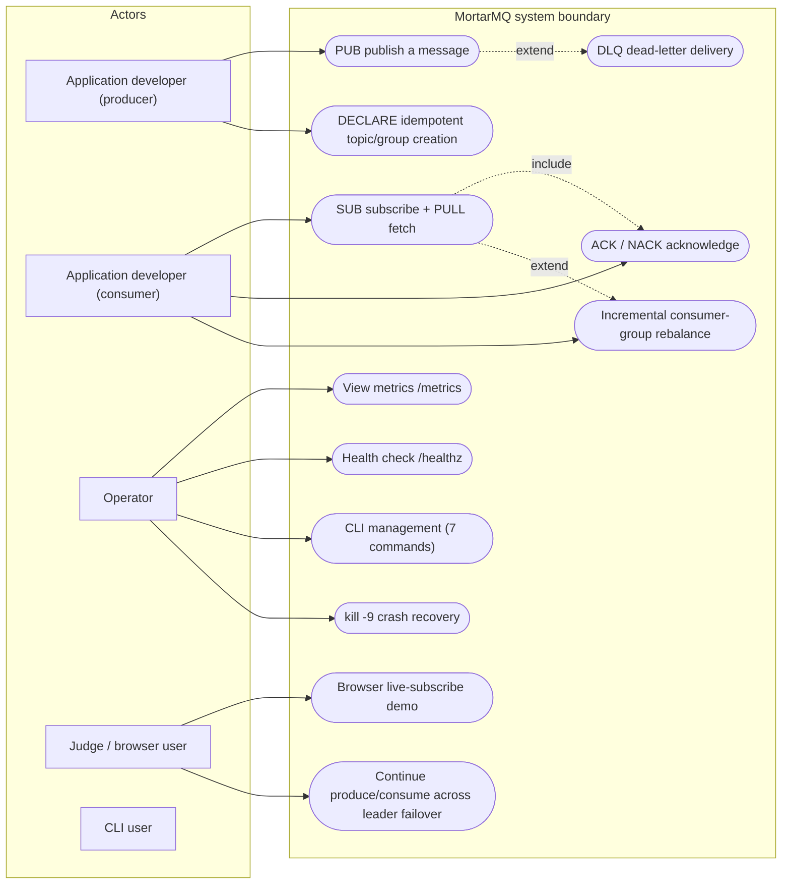
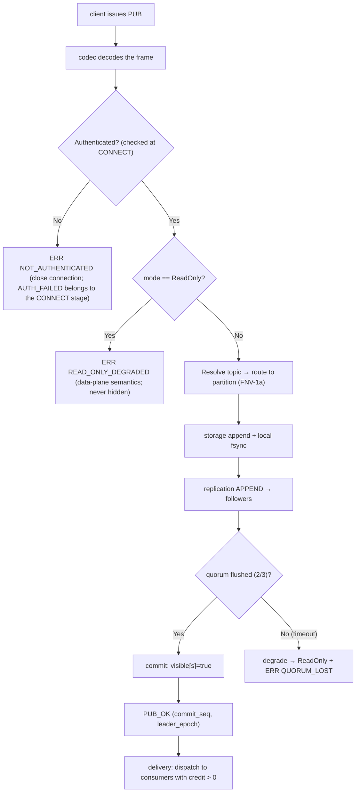
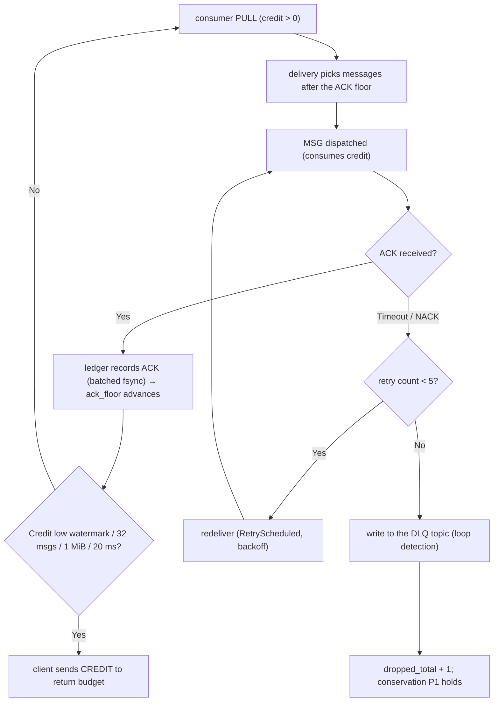

# 用例与流程

「**发生了什么**」的两个视角。用例图说**谁**要达成**哪个目标**；活动流程说 broker 为此**做了什么**。

> **与[关键时序](./sequences.md)的关系：** 那一页把同一条发布/消费链路画成具名参与者之间的消息交换。本页回答「走了哪条分支、守住了什么守恒」，[关键时序](./sequences.md) 回答「谁按什么次序对谁说话」。两者是同一条链路的两种记法 —— 谁也不是谁的子集。

> UML 说明：mermaid 没有原生用例图，这里用 flowchart 近似 —— `([ ])` 胶囊是用例，具名节点是 actor，include/extend 用虚线标注。同理，mermaid flowchart 承载活动图语义（圆角=动作，菱形=判定，并行用 subgraph 表达）。

## 用例

### Actor × Goal 表（语义基线）

下表而非图，才是用例的**事实来源**。

| 角色 | 目标 | 前置条件 | 后置条件 / 例外 |
|---|---|---|---|
| 生产者开发者 | PUB 落盘持久化（多数派 fsync） | token 合法、quorum 健康 | quorum 丢失 → `READ_ONLY_DEGRADED`（可行动错误） |
| 生产者开发者 | 幂等地创建 topic | — | 同名同配置 → IDEMPOTENT_OK；同名不同配置 → MISMATCH |
| 消费者开发者 | 有序拉取并确认 | 组已 DECLARE | credit 耗尽 → 调度暂停（绝不静默丢弃） |
| 消费者开发者 | 5 次失败后进 DLQ | — | DLQ 环路检测 |
| 运维 | 观测健康与延迟 | — | 15 项指标白名单 + 只读状态可见 |
| 运维 | 节点崩溃后恢复 | — | 自动重新选举 / 元数据隔离处置手册 |
| 评委 | 5 分钟内在浏览器看到实时消息与延迟 | `moon run` | — |
| CLI 用户 | 脚本化管理 | broker 可达 | 退出码 0/2/3/4 |

### v2 用例（MVP 边界之外）

TLS 加密连接、ACL 授权管理、动态配置变更、在线分区扩容、通配符订阅 —— 见内部设计档案中对应的接口预留条目。

## 活动流程 A：发布（含落盘与降级分支）

## 活动流程 B：消费与确认（含重投与 DLQ）

## 关键语义说明

1. 两条流程的守恒交集是 CM1：`produced = delivered + dropped + dlq + Δdepth`（在静默窗口内成立）。
2. 每一个错误出口（X1/X2/K/S9）都是**可行动的错误码** —— 不允许静默丢弃。
3. 并发：流程 A 与 B 在不同角色间并发执行；broker 内部由每分区单写者协程序列化它们。
