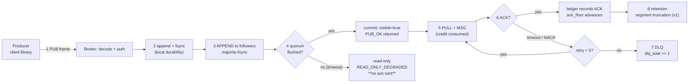

# Core Concepts

The message model in one page — what each noun means, and what it is for. Read it once before the [Architecture](./architecture.md) page, which assumes these.

Naming details (which field is called what, and why) live in the [Glossary](./glossary.md). This page is about **meaning**, not spelling.

## 1. Message model

MortarMQ has three roles. A **producer** writes messages, a **broker** stores and routes them, a **consumer** reads them. Producers and consumers are libraries inside your application; the broker is the server.

Every message belongs to exactly one **topic**, and a topic is split into a fixed number of **partitions**. A partition is the unit of ordering and the unit of storage — one append-only log file sequence per partition.

### Where a message goes (the full path)

Every "my message disappeared" investigation starts here. If you cannot point at the stage where it stopped, you are guessing:

Two properties of this path are worth internalising:

- **Nothing is acknowledged before stage 4.** A crash between 2 and 4 loses nothing *the producer was told succeeded* — `PUB_OK` has not been sent. This is why at-least-once starts at the ack, not at the write.
- **Stage 6 is the only place a consumer can lose a message, and it does not** — it redelivers (up to 5 attempts) and then dead-letters. "Dropped" in the metrics means *retried out*, not *thrown away*.

## 2. Topic

A topic is a named stream of messages of one kind. It is created explicitly with `DECLARE` and never implicitly: subscribing to a topic that does not exist returns `0x0008`.

Names are exact-match only in v0 — no wildcards — and are validated at declaration: no empty tokens, no `$` prefix, at most 255 bytes.

## 3. Partition

The partition count is fixed when the topic is created and **cannot change in v0**. Partition selection is `fnv1a32(key) % partition_count`, so the key decides ordering: same key, same partition, messages stay ordered.

A partition is also the unit of ownership — exactly one consumer in a group owns a partition at a time, and that ownership is fenced by an epoch (see §8).

## 4. Consumer group

A group is a set of consumers that share a topic's partitions. If three consumers join a group on a 12-partition topic, each ends up with roughly four partitions; add a fourth consumer and only *some* partitions move.

Groups are what makes consumer scaling possible without changing producers. Each group keeps its own cursor, so two groups read the same topic independently.

## 5. At-least-once delivery

A message is delivered, and delivery is only complete when the consumer **acknowledges** it. If the acknowledgement does not arrive before the lease expires (`delivery_lease_ms`, 30 s), the message is redelivered.

That means a consumer can see the same message twice — at-least-once, not exactly-once. What prevents duplicate *business* effects is idempotency: producers deduplicate on `(producer_id, producer_seq)`, and consumers key their own side effects on their business identifier, never on `delivery_id`.

## 6. Delivery ledger and ack floor

The **ledger** records `DELIVER` and `ACK` events separately from the message records themselves. Because it is separate, it survives a crash: on restart the redelivery timers are rebuilt from it, which is what makes the `kill -9` guarantee work.

`ack_floor` is the highest sequence such that everything below it has been acknowledged — the contiguous watermark. Unconsumed depth is `last_seq - ack_floor`, which is exactly what `mortarmq_partition_depth` reports.

## 7. Retry, DLQ, and dropped

A failed delivery is retried with backoff, up to `delivery_max_attempts` (5). On the fifth failure the message is written to the **dead-letter queue** rather than retried forever.

Three counters track this and they must satisfy `dlq_total <= dropped_total`: `dropped` counts messages that exhausted retries, `dlq` counts those that reached the DLQ. Anything else means the bookkeeping is wrong.

## 8. Epochs: the fencing family

Six counters look alike and are not interchangeable. The rule: **an epoch fences a specific kind of actor**.

- `leader_epoch` — the replication group's leader version. It is what rejects a stale leader's writes.
- `membership_epoch` — the version of the *member set*. Changes when a consumer joins or leaves.
- `assignment_epoch` — the version of the *target assignment*.
- `installed_assignment_epoch` — the version a member has *actually applied*. The gap between this and `assignment_epoch` is "the coordinator sent it, the member has not acted yet".
- `ownership_epoch` — who owns *one partition*. This is the one that rejects a consumer operating on a partition it no longer owns.
- `mutation_id` — the metadata log's monotonic change number, the floor that survives failover.

If you take one thing from this section: a stale actor is rejected **by epoch comparison**, not by timeout. Timeouts are for liveness; epochs are for safety.

## 9. Quorum and majority-fsync

A write is committed when a **majority** of the replica set has fsync'd it — leader plus one follower in a 3-node cluster. Only then does `commit_seq` advance and `PUB_OK` return.

If a majority cannot be reached in time, the broker enters read-only and returns `READ_ONLY_DEGRADED`. It does **not** acknowledge a write it cannot commit: the failure mode is a visible error, never silent data loss. See [RB-1](../guides/runbook.md#rb-1-quorum-degraded-→-read-only).

## 10. Metadata log (MMML)

Cluster metadata — topics, groups, leaders — lives in its own append-only mutation log plus periodic snapshots under `data/metadata/`. It is **not** Raft: changes are serialized through a single writer and fenced by `mutation_id`.

When the log cannot be trusted, the broker **quarantines** rather than guesses: the state moves to `data/metadata/quarantine/` and stops being served. Automatic replay from a quarantined directory is deliberately not implemented — reconciliation is a human decision.

## 11. Credit window (backpressure)

A consumer cannot pull without credit. The window starts at **256 messages / 2 MiB** and is returned in batches — 32 ACKs, 1 MiB, the low watermark, or a 20 ms timer, whichever fires first.

Credit is the only thing between a slow consumer and unbounded broker memory. Running out is normal flow control (`0x4006 NO_CREDIT`), not an error.

## 12. Rebalance

When group membership changes, partitions are reassigned. The reassignment is **incremental**: only the departed member's partitions move, and every unaffected partition keeps its ownership epoch untouched.

That is why an incremental rebalance is cheap — a full re-shuffle would invalidate every consumer's cursor position for no reason.

## 13. Segments and checkpoints

Each partition's log is cut into **segments** (64 MiB by default) with a sparse index for seeking and an atomic checkpoint for recovery. On restart the broker replays from the last checkpoint forward.

Segments carry a `magic` and a `format_version`; a binary that meets a version it cannot read **refuses** rather than guessing (upgrade case F3).

## 14. Honest boundaries

v0 does not have: TLS, dynamic tokens, per-topic authorization, config hot reload, log truncation, a Raft metadata quorum, dynamic membership, topic wildcards, or a changeable partition count.

Each omission is deliberate and each has an upgrade path — see [Upgrade](../guides/upgrade.md) and the [FAQ §5](../guides/faq.md#_5-honest-answers). The full threat model is [here](./security.md).
