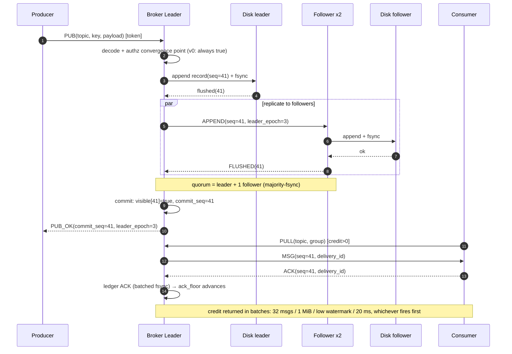

# Sequence Diagrams — Message Path and Ownership Changes

How messages and partition ownership actually move between named participants. Two scenarios, both `sequenceDiagram` with `autonumber`.

> **Relationship to [Use cases and flows](./use-cases-and-flows.md):** Scenario A's steady-state path below is the same link that page draws as an activity flowchart. Read that page for branch conditions and conservation formulas, this one for participant order and message contents.

## Publish Persistence + Consume Delivery (main success path)



### Exception Branches (summary of the failure paths of the same interaction)

| Failure point | Behavior | Error / state |
|---|---|---|
| Invalid token | Reject the connection's first frame | ERR AUTH_FAILED (generic + 100 ms) |
| Both followers lagging | Ack timeout → enter ReadOnly | ERR QUORUM_LOST / READ_ONLY_DEGRADED |
| Old leader rejoins | Epoch fencing: append rejected | STALE_LEADER_EPOCH (internal) |
| Consumer without credit | MSG scheduling pauses (no mid-frame read stalls) | Credit wait (not an error) |
| PUB replay (client retry) | Producer dedup on (producer_id, producer_seq); `delivery_id` only fences the consume side | Idempotent, no duplicate delivery |

### Relation to simulation and model checking

- This action sequence is one of the simulation's "golden traces" (the harness injects `kill -9` between steps 3–5).
- "Quorum flushed before commit" is the protocol projection of the `lease.qnt` invariant `visibleImpliesQuorumFlushed`.

## Scenario A: Consumer-Group Membership Change (incremental rebalance)

```mermaid
sequenceDiagram
    autonumber
    participant C1 as Consumer-1
    participant CO as Coordinator (broker leader)
    participant C2 as Consumer-2

    C2->>CO: JOIN(group, subscription)
    Note over CO: membership_epoch += 1<br/>target assignment: pure function assign(members, partitions, prev)
    Note over C1: C1's partitions unchanged → no notice, epochs untouched (CB3 / golden 23)
    CO->>C2: NOTICE ASSIGN(notice_id, new partitions)
    C2-->>CO: CONTROL_ACK(ASSIGN, OK)
    Note over CO,C2: Incremental (CB3): only the departed member's partitions move; unaffected partitions keep their ownership epochs

    C2->>CO: LEAVE
    Note over CO: membership_epoch += 1<br/>assignment_epoch += 1
    CO->>C1: NOTICE REVOKE(notice_id, only C2's former partitions)
    C1-->>CO: CONTROL_ACK(REVOKE, OK)
    CO->>C1: NOTICE ASSIGN(notice_id, take-over partitions)
    C1-->>CO: CONTROL_ACK(ASSIGN, OK)
```

## Scenario B: Lease-Timeout Degraded Election (Prepare/Install)

```mermaid
sequenceDiagram
    autonumber
    participant L as Leader(epoch=3)
    participant F1 as Follower-1
    participant F2 as Follower-2

    Note over L,F2: follower lease expired without a heartbeat
    F1->>F1: Prepare(candidate=4) persists promise
    F1->>F2: PREPARE(epoch=4)
    F2->>F2: promise(4) persisted, replies logEnd
    F2-->>F1: PREPARE_ACK(4, commit_seq)
    Note over F1,F2: majority promise (2/3) + take the highest durable prefix
    F1->>F1: Install: truncate uncommitted → take office as epoch=4
    F1->>F2: INSTALL(epoch=4)
    F2-->>F1: INSTALLED
    Note over L: when the old leader returns, append(epoch=3) is fenced;<br/>it demotes to follower and catches up
    L->>F1: APPEND(seq, epoch=3)
    F1-->>L: REJECT STALE_LEADER_EPOCH
```

## Semantic Anchors

| Interaction | Guarantee | Verification |
|---|---|---|
| All of scenario A | Incrementality / safety / liveness | CB1–CB4; slow-consumer / partition injection |
| Scenario B: majority promise before Install | No split brain | `inv_installNeedsQuorumPromise` |
| Scenario B: fencing | Visible log never regresses | `visibleMonotonic` |
| Shared constraint | Metadata mutations go through the single-writer metadata log | DECLARE/NOTICE idempotency |
