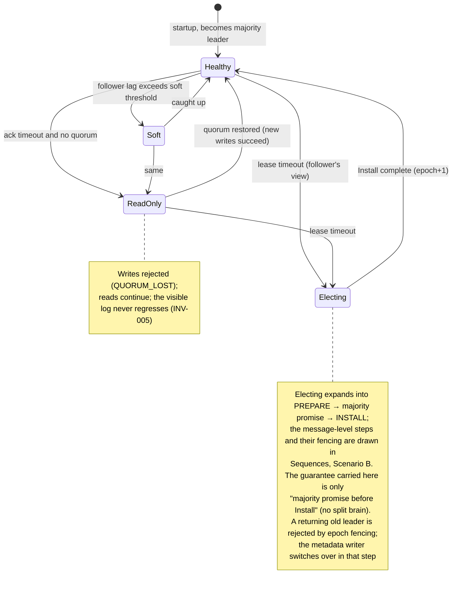
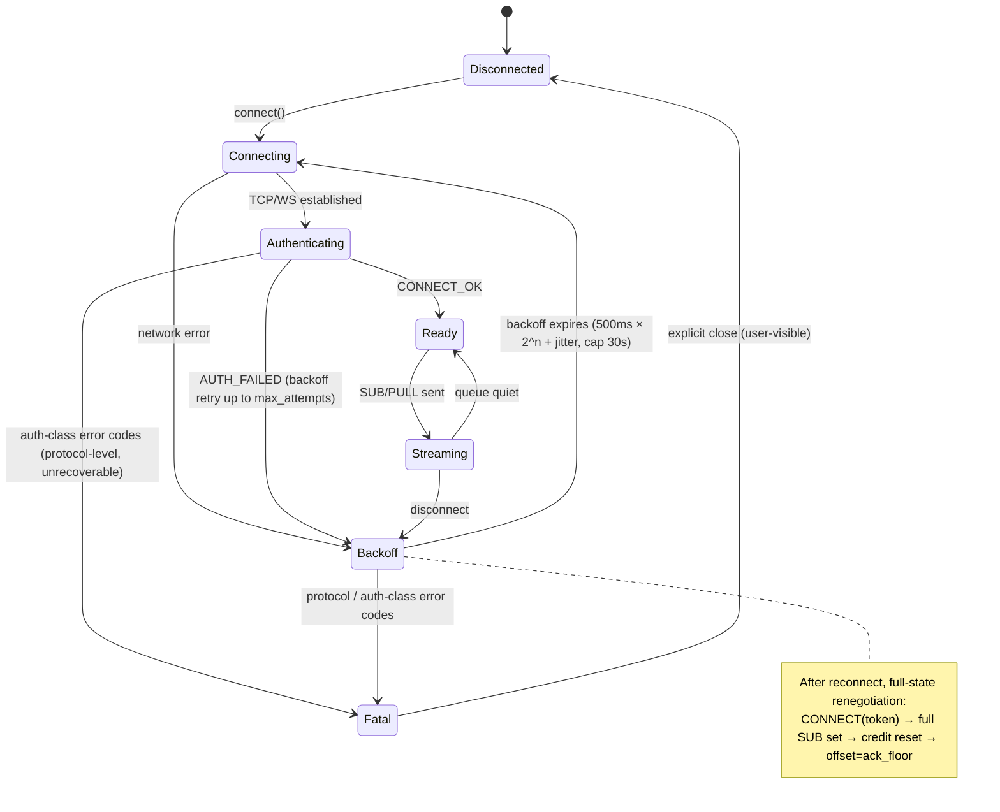
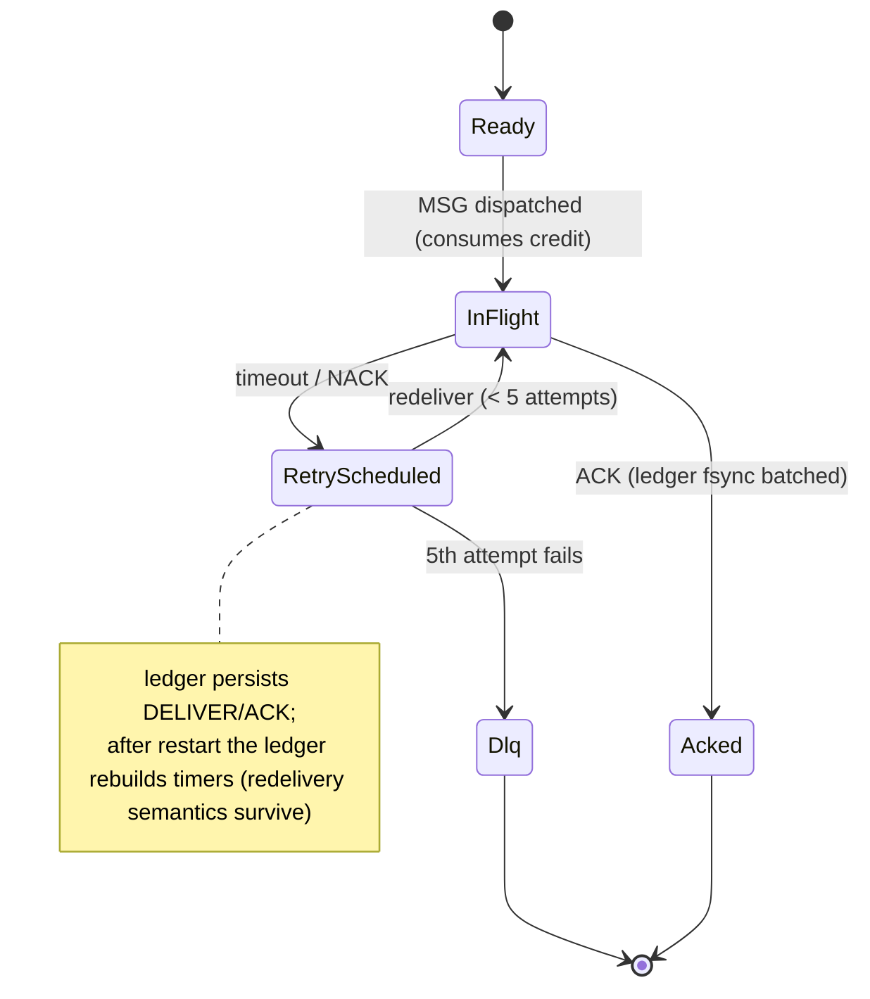
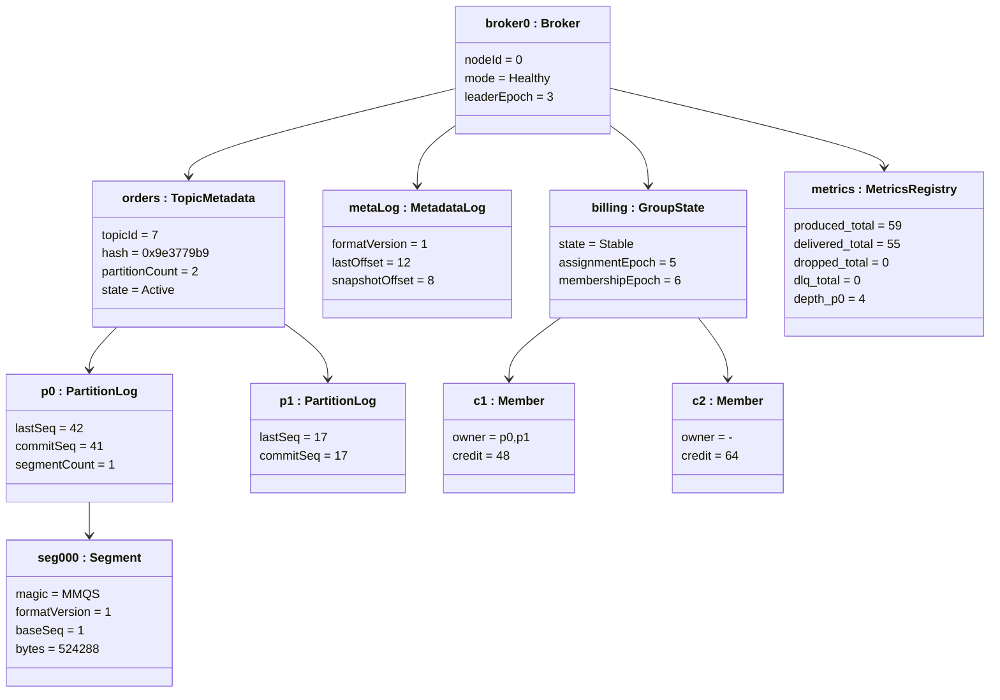

# States, Timing and Consistency Invariants

Three state machines, the latency budgets every design decision has to fit inside, and the runtime snapshot whose assertions tie all three together.

> **On placement:** the [object snapshot](#runtime-snapshot) lives here rather than in [Structure](./structure.md) because its payload is a table of *consistency assertions* written in the same invariant vocabulary (INV / CM / CB) as the state machines — not a statement about type layout.

> UML note: mermaid `stateDiagram-v2` carries the state-machine semantics directly. mermaid has no native timing diagram, so [Timing](#timing) uses ASCII lane timelines plus budget tables.

## State Machines

### State Machine 1: Broker Quorum / Leader State



### State Machine 2: Client Connection State (the no-sink property is CS1)



### State Machine 3 (supplementary): Delivery Message State (ledger view)



### Consistency Constraints (across state machines)

- Interaction of broker ReadOnly and client Backoff: on `READ_ONLY_DEGRADED` the client treats it as a "wait for recovery" action.
- The client's Fatal classification and the broker's error-code segments share one enum source (CI-asserted).

## Timing

> All numbers below are **design budgets (targets)** and are updated after measurement (the benchmark report) — unmeasured numbers are never presented as conclusions.

### Timeline 1: PUB End-to-End Acknowledgment (majority-fsync, 3 nodes on LAN)

```text
t(ms)  0        0.1      0.3       1.0        1.2        1.4      1.6
PUB ───┤ send   │        │         │          │          │        │
       ├────────►│ decode │         │          │          │        │
       │         ├──► append + fsync           │          │        │
       │         │        ├─ APPEND ►│          │          │        │  (follower)
       │         │        │         ├─ fsync ──►│          │        │
       │         │        │         │           ├─ FLUSHED ►│       │
       │         │        │         │           │          ├─commit─┤
       │◄───────────────────────────────────────────────── PUB_OK ──┤
                                                │
P50 budget ≤ 1.5 ms | P99 budget ≤ 5 ms (NVMe fsync dominates)
```

| Segment | Budget | Dominant cost | Notes |
|---|---|---|---|
| decode | ≤ 0.05 ms | BytesView zero-copy | — |
| local append + fsync | ≤ 0.3–1 ms | NVMe fsync | fsync dominates the budget |
| APPEND network | ≤ 0.1 ms | LAN RTT | — |
| follower fsync | ≤ 0.3–1 ms | awaited in parallel with the leader | — |
| FLUSHED + commit + OK | ≤ 0.1 ms | memory ops | — |
| **Total** | **P50 ≤ 1.5 ms / P99 ≤ 5 ms** | — | Over budget → analyze fsync and GC (zero-allocation design) |

### Timeline 2: Delivery and Redelivery Rhythm

```text
MSG dispatched ──┬────────────────────────────┐
                 │ credit return triggers (any) │
                 │  · 32 ACKs                   │
                 │  · 1 MiB returned            │
                 │  · below the low watermark   │
                 │  · 20 ms timer (latency cap) │
ACK ─────────────┤◄── CREDIT within 20 ms ──────┤
redelivery       ├─ attempt 1: +1 s, attempt 2: +2 s, attempt 3: +4 s, attempt 4: +8 s
backoff          │           (retry_backoff_base_ms=1000 × 2^n + jitter, cap max_backoff=30 s)
                 ├─ attempt 5 fails → DLQ (distinct from the client reconnect backoff 500ms × 2^n)
long poll        ├─ client PULL hangs up to 5 s (returns immediately when messages arrive)
heartbeat        ├─ client→broker PING every 30 s; server closes after 1.5×30 s silence
                 │           (keepalive semantics; v0 has no broker→client heartbeat frame)
```

### Timeline 3: Periodic Tasks (unified under the Clock abstraction, monotonic)

| Timer | Period / cap | Purpose | Clock property |
|---|---|---|---|
| Statsd-style metrics snapshot | 60 s (NSQ default) | Advance quantile windows | CL1 / CL2 |
| Lease heartbeat | leader→follower every period (< lease deadline) | Liveness trigger for election | CL1–CL3 |
| Ack-ledger fsync batch | 20 ms or 32 entries, whichever first | Persist batching | CL1 |
| CREDIT return | 20 ms latency cap | Flow-control liveness | CL1 / CL2 |
| Metadata snapshot | 8192 records / 64 MiB | Replay budget | — |

### Time-Dimensional Safety Constraints (aligned with the monotonic-clock discipline)

- **All scheduling uses only the monotonic clock**; wall-clock time appears only in log text.
- Clock rollback/jumps are an injection case in the simulation suite; the CL3 property asserts "rollback does not disturb trigger order".

## Runtime Snapshot

> UML note: an object diagram is a **snapshot** of the class diagram at a point in time. mermaid has no native object diagram, so this approximates it with class-diagram instance notation (`:Instance`) plus a snapshot table. During implementation, the `/stats` JSON can generate real snapshots to verify consistency against this example.

### Snapshot Scenario

A 3-node cluster is running: topic `orders` (2 partitions) exists, group `billing` has two consumers online; leader = broker-0, epoch = 3; partition-0 is durable through 42 and acknowledged through 38.



The classes instantiated above (`Broker`, `PartitionLog`, `Segment`, `MetadataLog`, `GroupState`, `MetricsRegistry`) are defined in [Structure](./structure.md); this is a point-in-time value view of them, not a second set of types.

### Snapshot Consistency Assertions (properties that must hold right now → register mapping)

| # | Assertion | Property |
|---|---|---|
| 1 | `p0.commitSeq(41) ≤ p0.lastSeq(42)` and every `visible[1..41]` is quorum-flushed | INV-006 (model-checking exclusive) |
| 2 | `metrics.depth_p0 = lastSeq - ackFloor = 42 - 38 = 4`, and `billing.c1` in_flight ≤ credit | CM3 / INV-003 |
| 3 | `produced(59) = delivered(55) + dropped(0) + dlq(0) + Δdepth(4)` | CM1 / INV-001 (quiet-window approximation) |
| 4 | `p1` has no in-flight and `lastSeq=commitSeq` → depth=0 | — |
| 5 | `billing` total partitions 2 = c1.owner count + c2.owner count | CB1 (exactly one owner per partition) |
| 6 | `metaLog.snapshotOffset(8) ≤ lastOffset(12)` (snapshots never run ahead of the log) | — |

### Uses

1. Documentation example: the illustration source for "what a running MortarMQ looks like" in README/QUICKSTART.
2. Test fixture: at demo time, cross-check real `/stats` JSON against these snapshot assertions (promoting the object diagram from "illustration" to "verifiable").
