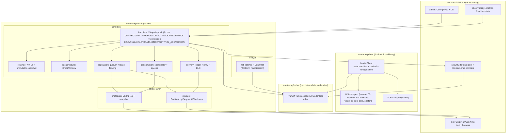

# Static Structure — Packages, Types and Dependency Rules

Read top-down: which **packages** exist and which direction dependencies may flow, then which **types** live inside them. Both diagrams express the same rule set — the component diagram states it as CI-enforced import assertions, the class diagram as type-level edges.

> UML note: mermaid subgraphs express component boundaries and arrows the allowed dependency directions; classDiagram carries type structure with `<<trait>>` / `<<enum>>` markers. **Reverse or cross-layer dependencies are forbidden** (CI import assertions).

## Module Boundaries and Dependency Rules



### Module Dependency Rules (an executable definition of high cohesion, low coupling)

| # | Rule | Violation | CI |
|---|---|---|---|
| 1 | `codec` may only import `moonbitlang/core` | Any internal dependency = red | import assertion |
| 2 | `storage` / `metadata` must not import the broker/handlers layer | Layer inversion = red | import assertion |
| 3 | The `client` package must not import any server package | Broken dual-platform isolation = red | import assertion |
| 4 | Cross-cutting packages (observability/admin/security/sim) may be called by the core or call codec/core interfaces; the core must never import observability implementations in reverse | Uncontrolled observability overhead = red | import assertion |
| 5 | Cross-module data exchange goes through immutable values/traits only — no shared mutable handles (the `BytesView` borrow exception is decode-path-only) | Review red line | review checklist |

### Component ↔ Quality-Attribute Mapping (excerpt)

| Component | Primary attributes carried |
|---|---|
| codec | Zero overhead, clear semantics (single enum source) |
| storage / metadata | Reliability, fault tolerance (quarantine), eventual consistency |
| delivery / consumption | Functional correctness, observability (conservation metrics) |
| replication | High availability, distributed fault tolerance, eventual consistency |
| observability / admin / security | Observability, operational safety, security |
| sim | Test infrastructure — side-effect traits in prod code are the zero-overhead premise |

## Core Type Structure

> Dependencies point strictly downward (client → codec is independent; within the server, net/codec ← core modules ← admin/observability). Traits are marked «trait». This diagram is the type-level expression of the dependency rules in the table above.

```mermaid
classDiagram
    direction TB

    class Frame {
        +op: u8
        +payload: BytesView (borrowed zero-copy)
    }
    class FrameDecoder {
        +decode_frame(data: BytesView) DecodeResult
    }
    class ErrCode {
        <<enum>>
    }
    class Conn {
        <<trait>>
        +read(buf) Result_u64
        +write(buf) Result_void
    }
    class TcpConn
    class WsSession {
        -maskread: bool
        -originOk: bool
    }
    Conn <|.. TcpConn
    Conn <|.. WsSession
    FrameDecoder ..> Frame
    FrameDecoder ..> ErrCode

    class PartitionLog {
        +topicId: u32
        +partition: u16
        +lastSeq: u64
        +append(rec) Result
        +fsyncRange(from, to) Result
        +replay(fromSeq) Result
    }
    class Segment {
        +magic: u32
        +formatVersion: u8
        +baseSeq: u64
    }
    class RecordHeader {
        <<56B>> (includes leader_epoch/replication_flags)
        +seq: u64
        +crc: u32
    }
    class SparseIndex {
        <<32B entry (cache-line aligned)>>
    }
    class Disk {
        <<trait>>
    }
    PartitionLog *-- "n" Segment
    Segment *-- "n" RecordHeader
    PartitionLog ..> SparseIndex
    PartitionLog ..> Disk

    class MetadataLog {
        +append(rec: MetaRecord) Result
        +replay() MetadataState
        +maybeSnapshot()
    }
    class MetaRecord {
        <<34B header + payload>>
        +recordType: u16
        +mutationId: u64
        +leaderEpoch: u64
    }
    class MetadataState {
        +topics: Map
        +groups: Map
        +brokers: Map
        +leader: LeaderInfo
    }
    MetadataLog ..> MetaRecord
    MetadataLog --> MetadataState

    class DeliveryLedger {
        +recordDeliver(seq, deliveryId)
        +recordAck(seq, deliveryId)
        +ackFloor: u64
    }
    class RetryTimer {
        +schedule(attempt, delayMs)
    }
    DeliveryLedger --> RetryTimer

    class GroupCoordinator {
        +assign(members, partitions, prev) Assignment
        +onJoin(member)
        +onLeave(member)
    }
    class Assignment {
        +assignmentEpoch: u32
        +entries: Map_Partition_Owner
    }
    GroupCoordinator --> Assignment

    class ReplicationEngine {
        +leaderEpoch: u64
        +mode: QuorumMode
        +onAppendFlushed(node, seq)
        +maybeCommit(seq)
    }
    class QuorumMode {
        <<enum>>
    }
    ReplicationEngine --> QuorumMode

    class CreditWindow {
        +remaining: u32
        +replenish(n, bytes)
    }

    class MetricsRegistry {
        +counter(name)
        +gauge(name)
        +exportText() Bytes
    }
    class QuantileStream {
        +insert(v: u64)
        +query(p: f64) u64
        +merge(other)
    }

    class ConfigRepo {
        +load(path) Config
        +items: 16 whitelist
    }
    class CliApp {
        +run(args) ExitCode
    }

    class Broker {
        +nodeId: u16
        +handleFrame(conn, frame)
    }
    class MortarClient {
        +state: ClientState
        +pub(topic, key, payload) Result
        +sub(topic, group, credit) Result
    }
    class ReconnectPolicy {
        +nextDelayMs(reconnects) u64
    }

    Broker --> PartitionLog
    Broker --> MetadataLog
    Broker --> DeliveryLedger
    Broker --> GroupCoordinator
    Broker --> ReplicationEngine
    Broker --> CreditWindow
    Broker --> FrameDecoder
    Broker --> Conn
    Broker --> MetricsRegistry
    Broker ..> ConfigRepo
    CliApp ..> FrameDecoder : remote client (writes via wire ops, reads via admin HTTP; never touches Broker internals)
    MortarClient --> FrameDecoder
    MortarClient --> Conn
    MortarClient --> ReconnectPolicy
    MortarClient --> CreditWindow
    MetricsRegistry --> QuantileStream
```

### Design Notes (against the coupling rules)

1. Isolation: `codec` (Frame/FrameDecoder/ErrCode) has zero internal dependencies and is shared by server and client; no server-side class imports the client package, and `MortarClient` depends only on codec/Conn. These are **restatements of rules 1 and 3 in the Module Dependency Rules table above** — the table is authoritative and is what CI enforces; this diagram is the type-level view of the same two rules.
2. The `Disk`/`Clock`/`Net`/`Rng` traits (only Disk shown) let the core modules run inside the simulation — production and simulation differ only in the impl.
3. `GroupCoordinator.assign` is a pure-function slot; incrementality is locked by the CB3 property.
4. `MetricsRegistry` is allowlist-registered; `QuantileStream` has the three-operation interface.
