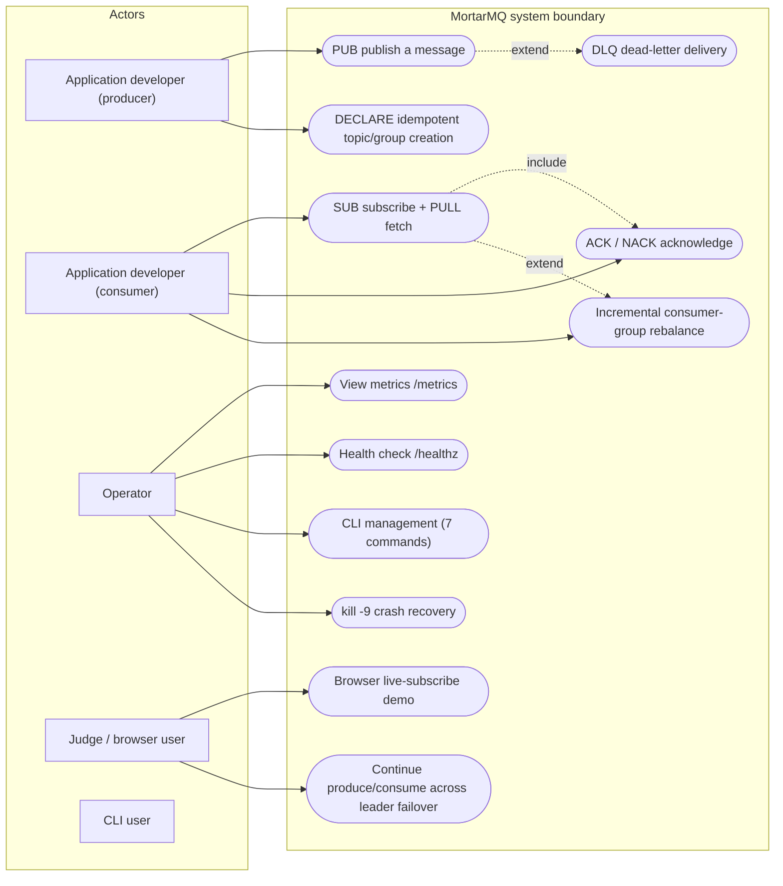
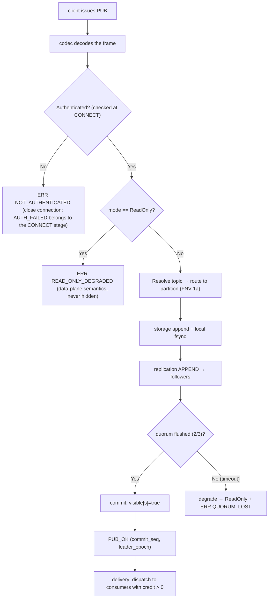
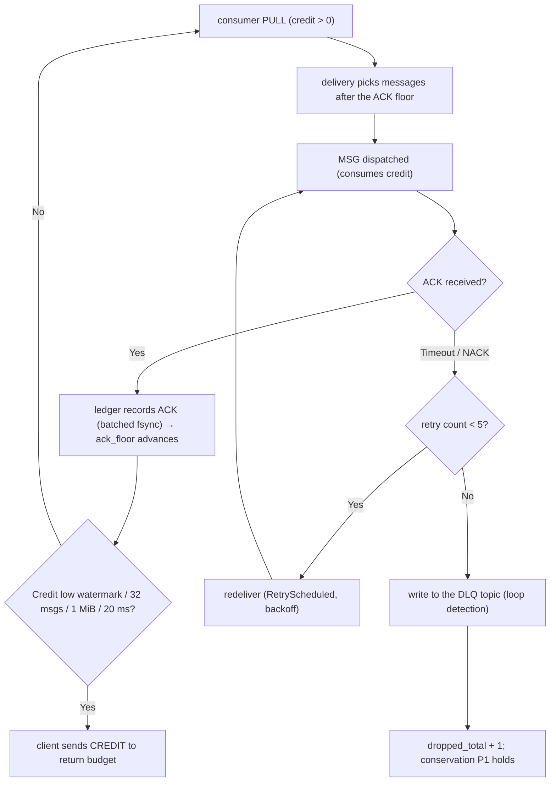

# Use Cases and Activity Flows

Two views of *what happens* in MortarMQ. The use-case diagram says **who** reaches **which goal**; the activity flows say **what the broker does** to get there.

> **Relationship to [Sequences](./sequences.md):** that page draws the same publish/consume link as a message exchange between named participants. This page answers *which branch is taken and what is conserved*; [Sequences](./sequences.md) answers *who speaks to whom in what order*. They are two notations over one link — neither is a subset of the other.

> UML note: mermaid has no native use-case diagram, so `([ ])` capsules stand for use cases and named nodes for actors, with include/extend as dashed edges. Likewise mermaid flowcharts carry the activity-diagram semantics (rounded = action, diamond = decision, parallelism shown as subgraphs).

## Use Cases

### Actor × Goal Table (semantic baseline)

The table below, not the picture, is the source of truth for the use cases.

| Actor | Goal | Precondition | Postcondition / exceptions |
|---|---|---|---|
| Producer developer | PUB durably persisted (majority-fsync) | Valid token, healthy quorum | Quorum lost → `READ_ONLY_DEGRADED` (actionable error) |
| Producer developer | Idempotent topic creation | — | Same name + same config → IDEMPOTENT_OK; different config → MISMATCH |
| Consumer developer | Ordered pull + acknowledge | Group already DECLAREd | Credit exhausted → scheduling pauses (nothing silently dropped) |
| Consumer developer | 5 failed attempts route to DLQ | — | DLQ loop detection |
| Operator | Observe health and latency | — | 15-metric allowlist + visible read-only state |
| Operator | Recover after a node crash | — | Automatic re-election / metadata quarantine runbook |
| Judge | Real-time messages + latency in the browser within 5 minutes | `moon run` | — |
| CLI user | Scripted management | Broker reachable | Exit codes 0/2/3/4 |

### v2 Use Cases (outside the MVP boundary)

TLS-encrypted connections, ACL authorization management, dynamic configuration changes, online partition expansion, wildcard subscriptions — see the corresponding interface-reservation entries in the internal design archive.

## Activity Flow A: Publish (including persistence and degradation branches)

## Activity Flow B: Consume and Acknowledge (including redelivery and DLQ)

## Key Semantic Notes

1. The conservation intersection of the two flows is CM1: `produced = delivered + dropped + dlq + Δdepth` (over a quiet window).
2. Every error exit (X1/X2/K/S9) is an **actionable error code** — silent drops are not allowed.
3. Concurrency: flows A and B run concurrently across actors; inside the broker, per-partition single-writer coroutines serialize them.
